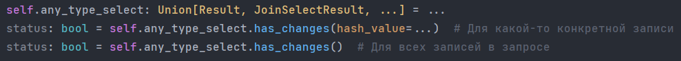

#
2-method ORM

--------
--------
# 
К практике

*
Рассмотрим функционал, который является основной компетенций данного фреймворка
*
 
- ### <code>*orm*.**set_item**(*_model*=None, *_ready*=False, *_insert*=False, *_update*=False, *_delete*=False, *_where*=None, **values)</code>
Установить в очередь запись-кандидата, которая появится в базе данных при первой возможности
- *_model*: Таблица из модуля ***models.py***. Можно не указывать, если в текущем контексте (вашего приложения)
уже установлена таблица в качестве основной (смотри класс ORM, метод set_model)
- - *_ready*: Логическое значение. До тех пор, пока это значение False, нода будет находиться в очереди, 
но commit базы данных не попадёт. Идеальный способ передавать ответ от вашего *валидатора*
- - *_insert*, *_update*, *_delete*: Логическое значение. DML-SQL
- - *_where*: Словарь вида *column_name:value* для выражения *where*
- - *return* None

Пример: пользовательская функция-валидатор даёт ответ, готова ли данная запись на транзакцию во "внешний мир":

- ### <code>*orm*.**get_items**(*_model*=None, _db_only=False, _queue_only=False, **where)</code>
- - *_model*: Таблица из модуля ***models.py***. Можно не указывать, если в текущем контексте (вашего приложения)
уже установлена таблица в качестве основной (смотри класс ORM, метод set_model)
- - *_db_only*: Получать данные только из базы данных, игнорируя локальные элементы
- - *_queue_only*: Получать данные только из локальной очереди элементов, игнорируя базу данных
- - *return* Result
 
- ### <code>*orm*.**join_select**(**models*, _db_only=False, _queue_only=False, _on=None, **where)</code>
- - **models*: Таблицы из модуля ***models.py*** между которыми существует отношение (PK-FK)
- - *_db_only*: Получать данные только из базы данных, игнорируя локальные элементы
- - *_queue_only*: Получать данные только из локальной очереди элементов, игнорируя базу данных
- - *_on*: Словарь. Выражение ON в JOIN запросах. modelName.column1: modelName2.column2
- - *return* JoinSelectResult
----

## 
Union[*Result, JoinSelectResult*]

Он же

## 
Объект результата

Объекты результата, производные от класса ***BaseResult***, возвращаемые методами *orm*.**get_items** и 
*orm*.**join_select** соответственно, являются ***ЛЕНИВЫМИ*** объектами, 
то есть не содержат никакого результата явным образом, но хранят в себе все детали запроса.
При каждом взаимодействии с итератором, __contains__, __getitem__, __bool__, __len__ и даже __str__, происходит новый запрос.
> : - Что это, зачем, - зачем усложнять? Ведь можно написать запрос и получить ответ: здесь и сейчас  :question:  :question:  :question:

 Во-первых, я нахожу весьма удобным не писать отдельных пользовательских функций для мемоизации параметров запроса, 
чтобы потом возвращаться к этому снова и снова, заполняя своё приложение потенциально лишним кодом.
 Во-вторых, "под капотом" скрывается достаточно хитрая система, которая, если описать это просто, делает следующее:
1. Извлекает записи из базы данных
2. Извлекает записи из локальной базы данных
3. Реплицирует одно на другое: на записи из базы данных накладываются записи, которые хранятся локально, и, по тем или иным причинам, пока ещё не закоммитились.

 В-третьих, эти ленивые экземпляры дают большое количество синтаксического сахара, который, по заветам pythonicway,
избавит ваш интерфейс от каждой лишней строчки!

* **has_changes**

Просто обратимся к экземпляру, чтобы узнать, есть ли изменения в данных:

* **has_new_entries**

Также, можно с лёгкостью узнать, появились ли новые (или стали недоступны те, что получены) записи:

* *pointer* - геттер и сеттер для инициализации Pointer.
 
----

## 
Pointer

Ассоциируйте строку, представляющую __данные__, со ссылкой на получение __этих__ данных.
Работает как для запросов к 1 таблице, так и для запросов к нескольким таблицам одновременно.
> Экземпляр Pointer инкапсулируется в экземпляр результата и предназначен для чтения только по свойству, - не следует пытаться сделать на него ещё одну ссылку :rage: 
### Инициализация 
<code>*any_result*.**pointer** = ("кортеж", "совпадающий", "по", "длине", "с", "содержимым")</code> 
Каждый элемент этого *кортежа* будет ассоциирован с содержимым внутри результата 1 к 1. 
### Использование 
- *__getitem__*
<code>*any_result*.**pointer**["содержимым"]</code> - получить [-1] элемент
<code>*any_result*.**pointer**["кортеж"]</code> - получить [0] элемент
<code>*any_result*.**pointer**["совпадающий"]</code> - получить [1] элемент
 И так далее... 
- *__contains__* 
<code>"длине" in *any_result*.**pointer**  # True</code>
<code>"strstr" in *any_result*.**pointer**  # False</code>
<code>"с" in *any_result*.**pointer**  # True</code>
<code>"совпадающий" in *any_result*.**pointer**  # True</code> 
### Инвалидация
И всё было бы хорошо, но как только из базы данных придёт результат количественно, или, с записями, которые содержат другие первичные ключи
